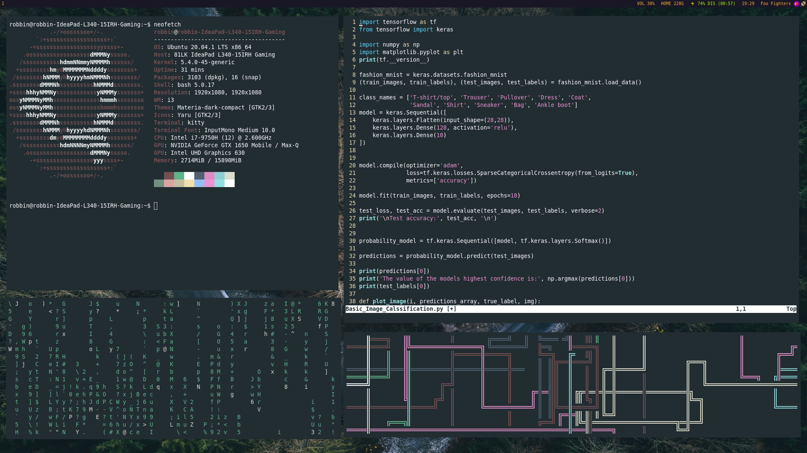

# My Dotfiles
This page contains my current dotfiles

## My I3WM Setup
This is how my i3wm setup looks like:

Empty schreenshot:

#### Programs used in this screenshot
- Top left:
    - [Neofetch](https://github.com/dylanaraps/neofetch)
- Bottom left:
    - [Cmatrix](https://github.com/abishekvashok/cmatrix)
- Top Right:
    - Vim with [basic image classification](https://www.tensorflow.org/tutorials/keras/classification)
- Bottom right:
    - [pipes.sh](https://github.com/pipeseroni/pipes.sh)

#### The terminal used in the screenshots:
 - [Kitty](https://sw.kovidgoyal.net/kitty/)
    - [The config here](https://github.com/RobbinKok/Dotfiles./blob/master/.config/kitty/kitty.conf)

#### The wallpaper:
- [Tristan Pineda on Unsplash](https://unsplash.com/photos/v2f2l0MVHdk)
